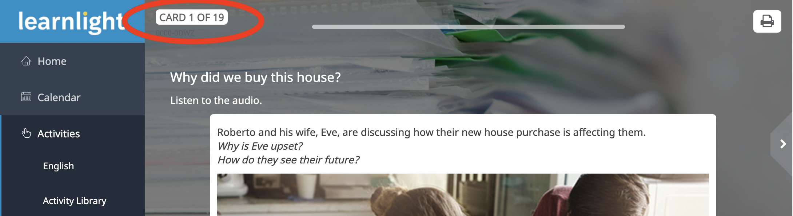

# Was ist das hier?
Ich fühle mich persönlich von den Learnlight Aufgaben unterfordert und empfinde die Aufgaben als Zeitverschwendung. Was macht ein Programmierer, wenn er einen überflüssigen Task sieht, der normalerweise ein paar Minuten braucht?
**Genau:** man nimmt unzählige Stunden Zeit, genau das zu automatisieren. Und hier darf ich nach echt vielen Arbeitsstunden mein Ergebnis präsentieren.

> **Achtung**: Sollte der Code bei einer Aufgabe nicht funktionieren, dann bitte als [Issue](https://github.com/paddy-314/learnlightsolver/issues), am besten mit Bildern, eintragen.

## just a heads-up
Die vorkommenden Wörter und Themen werden normalerweise auch in der Folgestunde behandelt. Deshalb ist es immer sinnvoll, die Aufgaben und deren Vokabeln zumindest einmal kurz anzuschauen.

## Wie ist das Skript aufgebaut?
Das Skript ist in Javascript geschrieben und in 2 Teile geteilt:
#### 1. Der Lernprozess
- Alle Karten werden nach der Reihe ohne Lösung abgegeben
- Die richtigen Lösungen werden im Speicher indexiert vermerkt

#### 2. Der Löseprozess
- Das Skript liest den Speicher aus
- Die entsprechende Frage wird gesucht und eingesetzt

## Wie führe ich das Skript aus?
Ganz wichtig ist es dabei, dass immer ***alle Karten wiederholt*** werden müssen. Nur dann kann das Skript die richtigen Karten mit den Lösungen wieder finden.
Es gibt lösbare Aufgaben und nicht lösbare Aufgaben. Sollte eine Aufgabe nicht lösbar sein, wird eine Notifcation wiedergeben. Diese Aufgabe muss dann selbstständig gelöst werden.

#### 1. Schritt: Eine beliebige Kartenserie heraussuchen und bis auf die erste Karte navigieren.

#### 2. Schritt: Entwickler-Konsole aufrufen und anschließend auf "Console" klicken
- `[F12]` oder
- `[Strg]`+`[Umschalt]`+`[J]` oder
- `[⌘]`+`[Optionstaste]`+`[J]`

#### 3. Schritt: Den Code kopieren, einfügen und `[Enter]`
#### 4. Schritt: Die Karten sollten jetzt automatisch durchgeskippt werden
#### 5. Schritt: Wenn das Skript durchgelaufen ist, muss der Button `"REDO ALL QUESTIONS"` ausgewählt werden

#### 7. Schritt: Wiederholen der [Schritte 1-4](#1-schritt-eine-beliebige-kartenserie-heraussuchen-und-bis-auf-die-erste-karte-navigieren)
#### 8. Schritt: Wenn alles geklappt hat, sollten nun 100% angezeigt werden :smile:

## Bekannte Fehler
- [ ] #2
- [ ] #3
- [ ] #4

## Hat Dir das Skript geholfen? 
Wenn Dir das Skript gefällt, Du Kritik loswerden willst oder Verbesserungsvorschläge hast, dann schreib gerne [hier rein](https://github.com/paddy-314/learnlightsolver/issues/1). Oftmals reicht ein einfaches "Danke", um jemanden den Tag zu versüßen.
