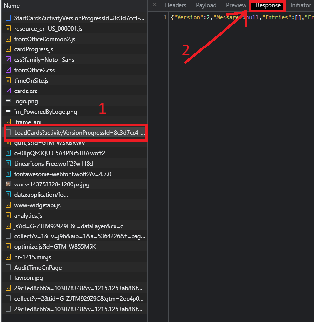

# Kurzbeschreibung
den Ordner herunterladen und den Inhalt der `LoadCards?...` auf der Learnlight Seite im Network Tab in die JSON dump file kopieren und dann das Python Programm im heruntergeladenen Ordner ausführen. 

*requires Python v. >=3.10*

